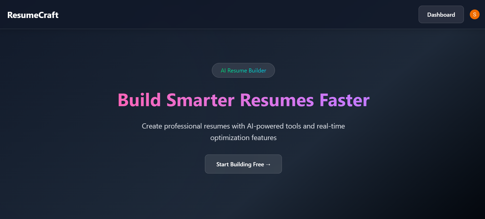
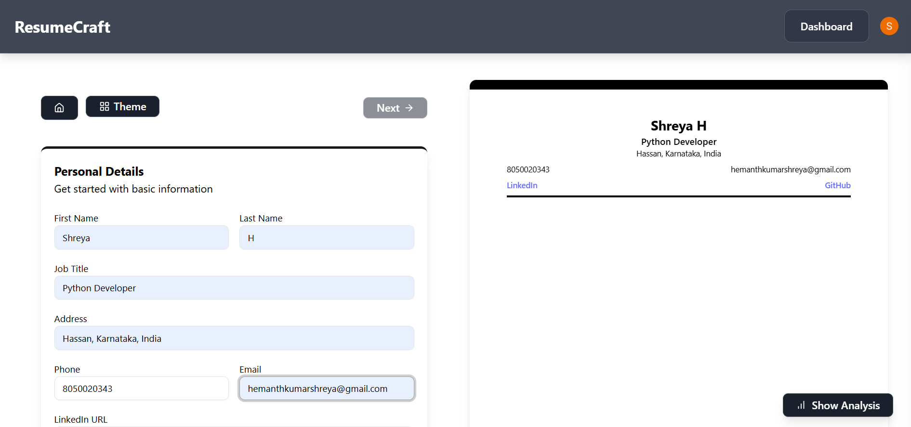
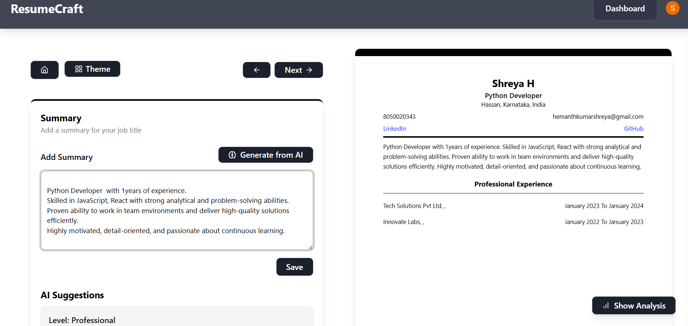
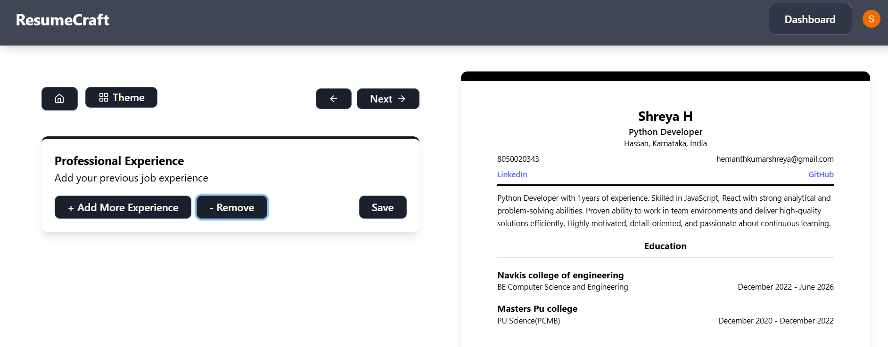
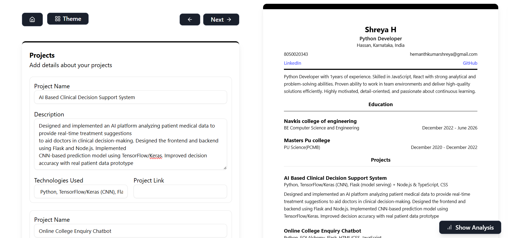
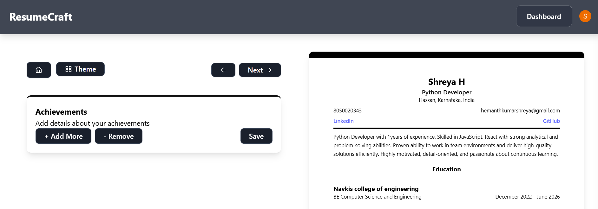
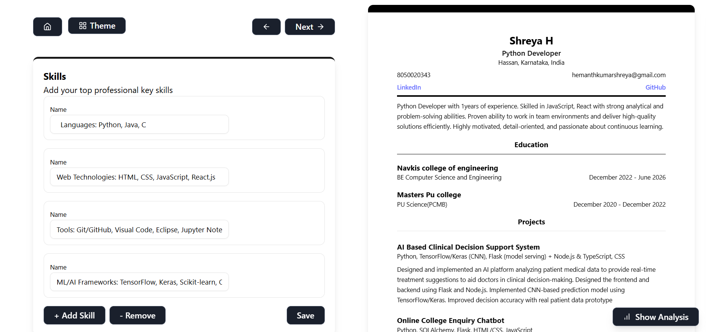
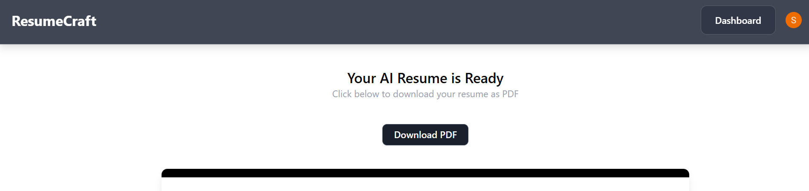

# 🧠 AI Resume Builder

A modern, AI-powered resume builder ,designed to help users create professional, ATS-optimized resumes in minutes. Integrates smart resume generation, real-time editing.

---

## ✨ Features

- 📄 ATS Optimization  
- 📥 Download Resume (PDF)  
- 📝 Real-Time Preview and Editing  
- 🌈 Multiple Theme Colors  
- 🔍 AI-Powered Resume Suggestions 

---

## 🔮 Planned Features

- 💼 Job Tracker Dashboard  
- 🎨 Multiple Resume Templates
- 🌐 Multi-language Support  
- 🎯 Resume Scoring and Feedback  
- 💬 Tone Customization  

---

## 📸 Screenshots











## 🚀 Getting Started

### 1. Clone the Repository

```bash
git clone https://github.com/ShreyaH-7/Smart-Resume-Maker.git
cd ai-resume-builder-frontend
```

### 2. Install Dependencies
```bash
npm install
# or
yarn install
```

### 3. Run the App
```bash
npm run dev
# or
yarn dev
```

### 🛠 Tech Stack
- React
- Vite
- TypeScript
- Tailwind CSS
- Postgres SQL
- Gemini API
- Vercel (Deployment) and Render (Backend Deployment)

### 🤝 Contributing
Contributions, issues, and feature requests are welcome!
- Fork the repo
- Create a new branch (git checkout -b feature/YourFeature)
- Commit your changes (git commit -m 'Add Feature')
- Push to the branch (git push origin feature/YourFeature)
- Open a pull request

### Author- Shreya H

